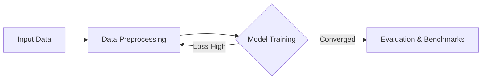

# 📝 Markdown & Formatting Reference (`MARKDOWN.md`)

This guide serves as the canonical Markdown, typography, and mathematical typesetting reference for `academicpages-astro`. Use this document to author rich blog posts, research papers, talks, teaching notes, portfolio items, and static pages.

> 🌐 **Live Rendered Demo**: To see how each syntax element renders visually in the browser, visit the live template demo at [https://arghyadipchak.github.io/academicpages-astro/markdown/](https://arghyadipchak.github.io/academicpages-astro/markdown/)

---

## 1. KaTeX & Mathematical Typesetting

Academic Pages Astro provides built-in server-side mathematical typesetting via KaTeX. Math formulas are compiled into standard HTML and MathML at build time with zero client JavaScript overhead.

### Inline Mathematics

Wrap inline formulas with single dollar signs (`$ ... $`):

```markdown
Euler's identity is $e^{i\pi} + 1 = 0$, and the Pythagorean theorem is $a^2 + b^2 = c^2$.
Gaussian integral: $\int_{-\infty}^{\infty} e^{-x^2} dx = \sqrt{\pi}$.
Summation: $\sum_{i=1}^n i = \frac{n(n+1)}{2}$.
```

### Display Equations

Wrap standalone equations with double dollar signs (`$$ ... $$`):

```markdown
$$
\int_{a}^{b} f(x) \, dx = F(b) - F(a)
$$
```

### Multiline Systems & Alignment

Use standard LaTeX alignment environments like `aligned`:

```markdown
$$
\begin{aligned}
\nabla \cdot \mathbf{E} &= \frac{\rho}{\epsilon_0} \\
\nabla \cdot \mathbf{B} &= 0 \\
\nabla \times \mathbf{E} &= -\frac{\partial \mathbf{B}}{\partial t} \\
\nabla \times \mathbf{B} &= \mu_0 \left(\mathbf{J} + \epsilon_0 \frac{\partial \mathbf{E}}{\partial t}\right)
\end{aligned}
$$
```

### Matrices & Brackets

```markdown
$$
\mathbf{A} = \begin{pmatrix}
a_{11} & a_{12} \\
a_{21} & a_{22}
\end{pmatrix}
$$
```

---

## 2. Notice Callouts & Alerts

### GitHub-Style Markdown Alerts (Recommended)

Rendered with themed background colors, icons, and border accents:

```markdown
> [!NOTE]
> Useful information that users should know, even when skimming

> [!TIP]
> Helpful advice for doing things better or more easily

> [!IMPORTANT]
> Key information users need to know to achieve their goal

> [!WARNING]
> Urgent info that needs user immediate attention to avoid problems

> [!CAUTION]
> Advises about risks or negative outcomes of certain actions
```

### HTML Notice Boxes

Legacy AcademicPages notice classes are also supported for inline HTML callouts:

```html
<div class="notice">
  <strong>Default Notice:</strong> Standard callout box for general
  announcements
</div>

<div class="notice notice--info">
  <strong>Info Notice:</strong> Highlights helpful context or background
  information
</div>

<div class="notice notice--warning">
  <strong>Warning Notice:</strong> Cautions readers about potential issues or
  prerequisites
</div>

<div class="notice notice--danger">
  <strong>Danger Notice:</strong> Alerts readers to breaking changes, errors, or
  critical warnings
</div>

<div class="notice notice--success">
  <strong>Success Notice:</strong> Indicates successful completion,
  confirmations, or verified statuses
</div>
```

---

## 3. Interactive Diagrams & Charts

### Mermaid.js Diagrams

Academic Pages Astro supports interactive client-side diagrams rendered via Mermaid:

````markdown

````

### Plotly.js Scientific Charts

Embed interactive Plotly scatter, line, contour, or subplot charts directly in code blocks with JSON parameters:

````markdown
```plotly
{
  "data": [
    {
      "x": [1, 2, 3, 4, 5],
      "y": [1, 6, 3, 6, 1],
      "mode": "markers",
      "type": "scatter",
      "name": "Group A",
      "marker": { "size": 10 }
    }
  ],
  "layout": {
    "title": { "text": "Interactive Plotly Scatter" }
  }
}
```
````

> [!NOTE]
> All JSON keys in Plotly blocks must be double-quoted for valid parsing

---

## 4. Academic Publication Action Badges

When authoring research entries in `src/content/publications/`, setting URLs (`pdf_url`, `slides_url`, `code_url`) and `bibtex` in frontmatter automatically renders interactive action badges (`[PDF]`, `[Slides]`, `[Code]`, `[BibTeX]`):

- **Interactive BibTeX**: Clicking the `[BibTeX]` badge triggers a 1-click citation copy modal
- **Asset Links**: PDF and slide links open in a new tab with secure `target="_blank"` attributes
- **Schema Details**: For full frontmatter schemas and publication fields, see [`docs/CONTENT.md`](CONTENT.md#2-publications-srccontentpublications)

---

## 5. Buttons & Interactive Links

Apply `.btn` utility classes to standard links to render prominent action buttons:

```html
<a href="#" class="btn btn--primary">Primary Button</a>
<a href="#" class="btn btn--inverse">Inverse Button</a>
<a href="#" class="btn btn--info">Info Button</a>
<a href="#" class="btn btn--warning">Warning Button</a>
<a href="#" class="btn btn--danger">Danger Button</a>
<a href="#" class="btn btn--success">Success Button</a>
```

---

## 6. Collapsible Details & Accordeons

Use standard HTML `<details>` and `<summary>` elements to create collapsible sections:

```html
<details>
  <summary>Click to expand technical proof</summary>
  Detailed mathematical derivations and supplementary proofs go here
</details>

<details open>
  <summary>Open by default</summary>
  This section remains expanded on page load
</details>
```

---

## 7. Headings & Document Hierarchy

```markdown
# Heading Level 1 (Page Title)

## Heading Level 2 (Major Section)

### Heading Level 3 (Subsection)

#### Heading Level 4 (Sub-subsection)
```

- Each H2 and H3 automatically generates an anchor link
- Enabling `toc: true` in frontmatter populates headings into the interactive Table of Contents sidebar

---

## 8. Text Formatting & Inline Elements

| Syntax                             | Description                    | Example                        |
| :--------------------------------- | :----------------------------- | :----------------------------- |
| `**bold text**`                    | Bold / Strong emphasis         | **bold text**                  |
| `*italic text*`                    | Italic / Emphasis              | _italic text_                  |
| `~~strikethrough~~`                | Deleted or struck-through text | ~~strikethrough~~              |
| `` `inline code` ``                | Monospace code snippet         | `console.log()`                |
| `[Link Text](https://example.org)` | Hyperlink                      | [Website](https://example.org) |
| `Subscript ~H2O~`                  | Subscript text                 | H~~2~~O                        |
| `Superscript ^2^`                  | Superscript text               | E = mc^2^                      |

---

## 9. Lists & Task Lists

### Nested Unordered & Ordered Lists

```markdown
- List item one
  - Indented sub-item
  - Another sub-item
- List item two

1. First chronological step
2. Second step
   1. Sub-step A
   2. Sub-step B
```

### Interactive Task Lists

```markdown
- [x] Completed task item
- [ ] Incomplete task item
- [ ] Optional milestone
```

---

## 10. Code Blocks & Syntax Highlighting

Fenced code blocks support syntax highlighting for 100+ programming languages:

````markdown
```typescript
interface Publication {
  title: string;
  authors: string[];
  year: number;
}

const paper: Publication = {
  title: 'Attention Is All You Need',
  authors: ['Vaswani et al.'],
  year: 2017,
};
```
````

```markdown
Supported language tags include: `ts`, `js`, `python`, `rust`, `c`, `cpp`, `bash`, `json`, `yaml`, `latex`, `html`, `css`, `r`, `sql`
```

---

## 11. Tables

```markdown
| Author     | Paper Title               | Venue  | Year |
| :--------- | :------------------------ | :----: | ---: |
| Jane Doe   | Deep Learning for Science | Nature | 2024 |
| John Smith | Fast Graph Algorithms     |  ACM   | 2023 |
```

- `:---` left-aligns column
- `:---:` centers column
- `---:` right-aligns column

---

## 12. Footnotes & Citations

```markdown
Here is a sentence with an academic citation footnote.[^1]

Here is another statement requiring reference.[^doe2024]

[^1]: Smith et al., "Title of Paper", Conference on AI, 2023

[^doe2024]: Doe, J., "Advanced Mathematical Modeling", Cambridge University Press, 2024
```

Footnotes are automatically numbered and appended at the bottom of the page with return back-links.

---

## 13. Semantic HTML & Typographic Tags

Academic Pages Astro provides default typography styles for semantic HTML elements:

- `<kbd>Cmd</kbd> + <kbd>K</kbd>`: Renders styled keyboard shortcuts
- `<abbr title="Hypertext Markup Language">HTML</abbr>`: Renders dotted underline abbreviation with tooltip
- `<cite>Source Title</cite>`: Renders cited publication or speech title
- `<var>x</var>`: Formats algebraic variables
- `<ins>Inserted text</ins>`: Underlines newly inserted content
- `<address>`: Formats institutional mailing addresses
- `<dl>`, `<dt>`, `<dd>`: Formats definition lists
